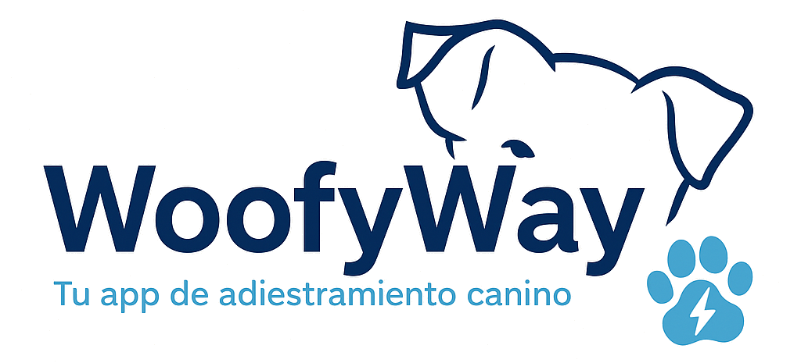

  

<h1 align="center">🐶 WoofyWay</h1>

App de adiestramiento canino inteligente

  
  
  

---

## 📱 Descripción

WoofyWay es una aplicación móvil desarrollada como Trabajo de Fin de Grado (TFG) en Desarrollo de Aplicaciones Multiplataforma (DAM).

Permite gestionar el entrenamiento de perros mediante ejercicios guiados, planes personalizados y seguimiento del progreso.

---

## 🚀 Tecnologías utilizadas

- React Native (Frontend)
- Node.js + Express (Backend)
- PostgreSQL (Base de datos)
- Expo (Testing móvil)

---

## 📂 Estructura del proyecto
WoofyWay/
├── frontend/      # App móvil (React Native + Expo)
│   ├── assets/
│   ├── components/
│   ├── screens/
│   ├── data/
│   ├── App.js
│   ├── AppNavigator.js
│   └── theme.js
│
├── backend/       # API REST (Node.js + Express)
│   ├── controllers/
│   ├── routes/
│   ├── middleware/
│   ├── db/
│   └── server.js
│
├── database/      # Base de datos PostgreSQL
│   └── woofyway.sql
│
├── docs/          # Recursos visuales y documentación
│   ├── login-web.png
│   ├── dashboard.png
│   ├── ejercicios.png
│   ├── progreso.png
│   ├── demo.mp4
│   └── TFG.pdf
│
└── README.md

## 📸 Capturas de pantalla

### 🔐 Login

---

### 🏠 Dashboard

---

### 🐶 Perfil del perro

---

### 🏋️ Ejercicios

---

### 📘 Detalle de ejercicios

#### Ejercicio 1

#### Ejercicio 2

#### Ejercicio 3

---

### 📊 Progreso

---

### 📋 Planes de entrenamiento

---

### 👋 Cierre de sesión

---

## 🎥 Demo del proyecto

📹 Ver demo:  
[Descargar vídeo](docs/demo.mp4)

---

## 📄 Documentación

📘 Memoria del TFG:  
[Descargar PDF](docs/TFG-MATHEUS-FERREIRA-CESUR-MADRID.pdf)

---

## 🎯 Objetivo del proyecto

Desarrollar una aplicación funcional de adiestramiento canino que permita:

- Mejorar la relación entre dueño y mascota  
- Facilitar el aprendizaje de comandos básicos  
- Implementar un sistema escalable real  

---

## 🚧 Mejoras futuras

- Conexión completa en tiempo real con backend  
- Notificaciones push  
- Sistema de recomendaciones personalizadas  
- Deploy en producción  
- Mejora de UI/UX  

---

## 👨‍💻 Autor

Matheus Ferreira  
Técnico Superior en DAM

---

## 📌 Notas

Proyecto desarrollado con fines educativos, pero diseñado con una arquitectura preparada para una posible aplicación real.