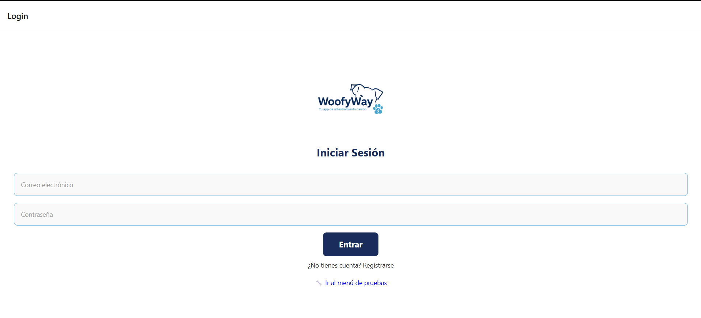
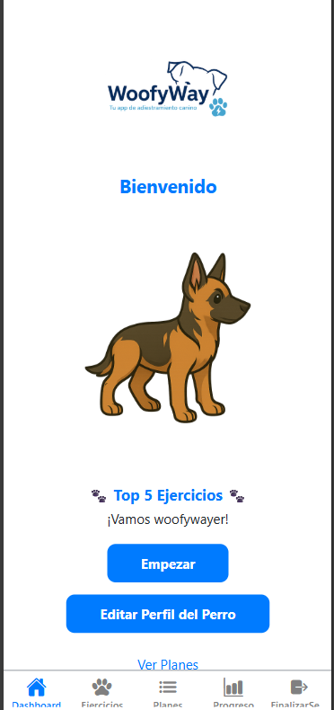
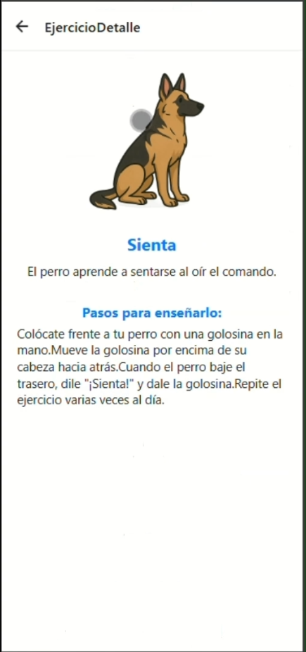

# 🐶 WoofyWay - App de Adiestramiento Canino

Aplicación móvil fullstack desarrollada como Trabajo de Fin de Grado (TFG) en Desarrollo de Aplicaciones Multiplataforma (DAM).

WoofyWay permite a los usuarios gestionar el entrenamiento de sus perros mediante ejercicios guiados, planes personalizados y seguimiento de progreso.

---

## 🚀 Tecnologías utilizadas

* React Native (Expo)
* Node.js + Express
* PostgreSQL
* JWT (autenticación)

---

## 📱 Funcionalidades principales

* Registro e inicio de sesión de usuarios
* Gestión del perfil del perro
* Listado de ejercicios de adiestramiento
* Detalle paso a paso de cada ejercicio
* Planes de entrenamiento personalizados
* Seguimiento del progreso
* Navegación completa entre pantallas

---

## 📸 Capturas de pantalla

### 🔐 Login (Web)

### 📱 Login (Mobile)

---

### 🏠 Dashboard

---

### 🐶 Perfil del perro

---

### 🏋️ Ejercicios

---

### 📘 Detalle de ejercicios

---

### 📊 Progreso

---

### 📋 Planes de entrenamiento

---

### 👋 Cierre de sesión

---

## 🎥 Demo de la aplicación

👉 [Ver demo completa](docs/demo.mp4)

---

## 📄 Documentación completa

👉 [Ver documento TFG](docs/TFG-MATHEUS-FERREIRA-CESUR-MADRID.pdf)

---

## 🧠 Arquitectura

* Frontend: React Native
* Backend: API REST con Node.js
* Base de datos: PostgreSQL
* Autenticación mediante JWT

---

## 📚 Aprendizajes

* Desarrollo fullstack
* Consumo de APIs
* Autenticación de usuarios
* Diseño de bases de datos
* Organización de proyectos reales

---

## 🧑‍💻 Autor

Matheus Ferreira
Técnico Superior en Desarrollo de Aplicaciones Multiplataforma (DAM)

---

## 📌 Notas

Proyecto desarrollado con fines educativos, con enfoque en arquitectura escalable y posibilidad de evolución a producto real.
